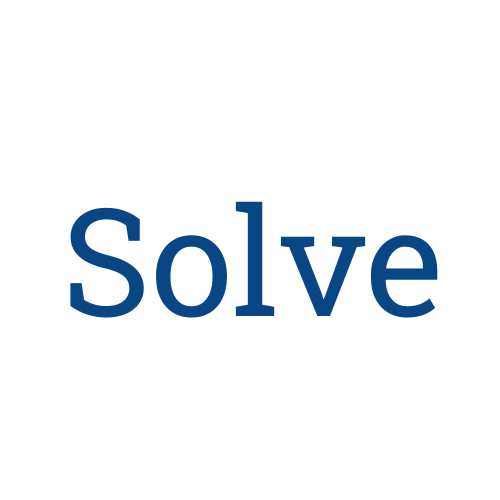
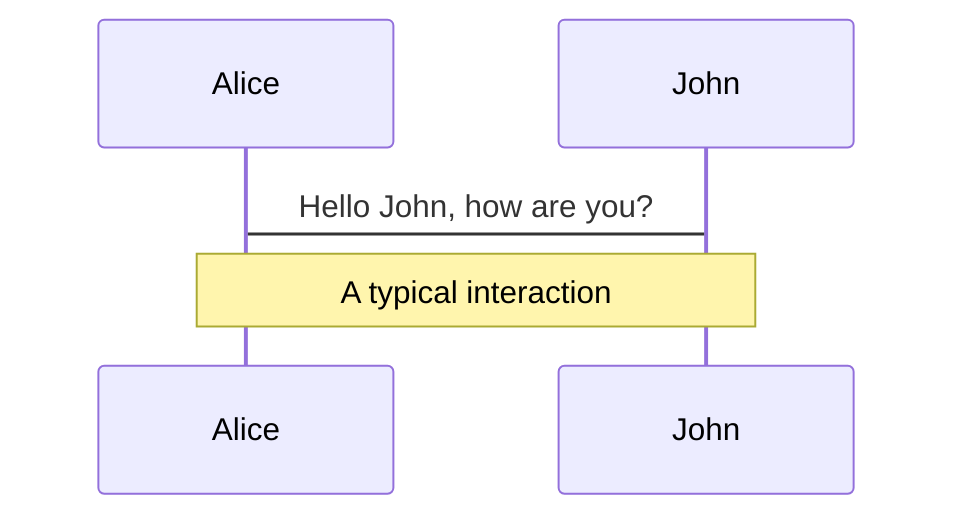
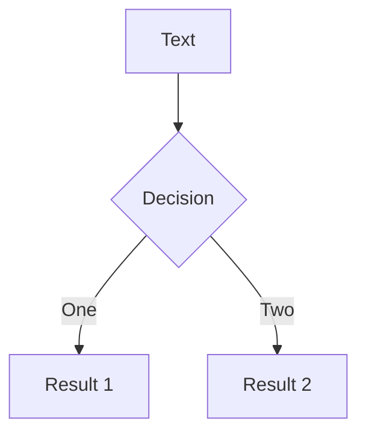

---
# try also 'default' to start simple
theme: seriph
# random image from a curated Unsplash collection by Anthony
# like them? see https://unsplash.com/collections/94734566/slidev
background: '#fff'
# apply any windi css classes to the current slide
class: 'text-center'
# https://sli.dev/custom/highlighters.html
highlighter: shiki
# show line numbers in code blocks
lineNumbers: false
# some information about the slides, markdown enabled
info: |
  ## Solve app
  Distributed problem-solving app.

  Learn more at [solve-app.co](https://solve-app.co)
# persist drawings in exports and build
drawings:
  persist: false
---

<center>
  
</center>
Distributed problem-solving app.

Video?
---

# Where does the idea come from?

 - Case studies:
   - Mental health
   - Finance consulting
   - Relationship management

---

# Showcase

 * Two screens
 * Two persons logging in, person A, person B
 * They have one problem each on their dashboards
 * Person A goes into his main problem
 * Person A creates some nodes
 * Person A creates some edges
 * Person A selects some part of his problem and shares it with a meaningful name
 * Person B sees that problem and joins it
 * Person B creates some nodes and edges
 * Person B saves the problem
 * Person A sees the proposal in his subgraph screen
 * Person A accepts the proposal
 * Person A attempts to merge the subproblem into his main view
 * Problem solved!
---
# Reward and gamification

Show the screenshot of the score bubble in the user interface.
Explain the idea of experience points
---
# Future plans

 * ML
 * Template marketplace

---

# Animations

Animations are powered by [@vueuse/motion](https://motion.vueuse.org/).

```html
<div v-motion :initial="{ x: -80 }" :enter="{ x: 0 }">Slidev</div>
```

<div class="w-60 relative mt-6">
  <div class="relative w-40 h-40">
    
    
    
  </div>

  <div
    class="text-5xl absolute top-14 left-40 text-[#2B90B6] -z-1"
    v-motion
    :initial="{ x: -80, opacity: 0}"
    :enter="{ x: 0, opacity: 1, transition: { delay: 2000, duration: 1000 } }">
    Slidev
  </div>
</div>

<!-- vue script setup scripts can be directly used in markdown, and will only affects current page -->
<script setup lang="ts">
const final = {
  x: 0,
  y: 0,
  rotate: 0,
  scale: 1,
  transition: {
    type: 'spring',
    damping: 10,
    stiffness: 20,
    mass: 2
  }
}
</script>

<div
  v-motion
  :initial="{ x:35, y: 40, opacity: 0}"
  :enter="{ y: 0, opacity: 1, transition: { delay: 3500 } }">

[Learn More](https://sli.dev/guide/animations.html#motion)

</div>

---

# Diagrams

You can create diagrams / graphs from textual descriptions, directly in your Markdown.

<div class="grid grid-cols-2 gap-10 pt-4 -mb-6">





</div>

[Learn More](https://sli.dev/guide/syntax.html#diagrams)

---
layout: center
---

# Learn More

## [GitHub](https://github.com/w8r/solve)

---
