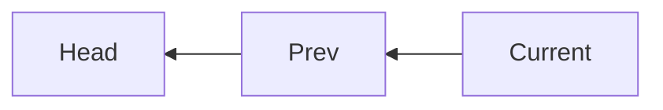
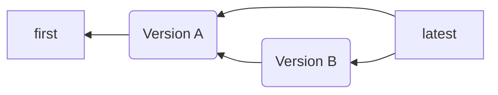

---
# try also 'default' to start simple
theme: seriph
# random image from a curated Unsplash collection by Anthony
# like them? see https://unsplash.com/collections/94734566/slidev
background: '#fff'
# apply any windi css classes to the current slide
class: 'text-center'
# https://sli.dev/custom/highlighters.html
highlighter: shiki
# show line numbers in code blocks
lineNumbers: false
# some information about the slides, markdown enabled
info: |
  ## Solve app
  Distributed problem-solving app.

  Learn more at [solve-app.co](https://solve-app.co)
# persist drawings in exports and build
drawings:
  persist: false

---

  

    

      
    

    
Distributed problem-solving app.

  

  

    

      
    

  

---
layout: section
---

# What is the problem?

 

  Everyone has problems: health, money, relationships or the meaning of life itself. Some of them are very hard. And they never stop repeating themselves. Problem is - we are often not very good at identifying and resolving them and it gets infinitely harder when we are ill, depressed or under a lot of stress.

---
layout: section
---
# What is a problem?

 

In order to understand the root cause of our issues and/or ask for help when needed, we should be able to state our problem and communicate it very clearly.

For some cases, words alone can be enough to express ourselves.

However, problems are not always simple enough to put clearly or to be solved without assistance.

---
layout: center
---
# What is the problem?

 

- Problems can be expressed visually as graphs: entities and relationships between them.
- Human brain is amazing at finding and matching patterns.
- Two hands are better than one: collaboration allows discovering different points of view to the same problem.

---
layout: center
---

# Where does the idea come from?

  - you often cannot put your problems into words
  - you keep on forgetting what you have already formulated
  - you are not very good at seeing patterns in your problems
  - but you can see them well in the problems of others
  - you are often an "unreliable partner" to yourself

---
layout: center
---

# You can see this pattern everywhere:

 - mental health issues
 - money management
 - relationships problems
 - long-lasting projects
 - self-discovery

---
layout: image-right
image: /screens/general2.png
---

# How to solve problems?

### We have designed an application that will help you to:

 - identify and describe your problems with visualisations
 - apply hierarchical thinking to solve your problems
 - share your problems with others and work together to solve them
 - help others by proposing your solutions
 - share your ideas

---
layout: center
---

# Log in from any device

Web/iOS/Android

---

  

    <h1>Your projects</h1>
     
    <h3>Projects</h3>
    

     This is the list of your current big life situations.
     Imagine you are buying a flat, changing your job, or going through a depression?
    

    <h3>Solutions</h3>
    
It's the problems of other people, that you are helping them to solve

  

  

  

---

 

    <h1>Describe your situation</h1>
     
    

    Instead of using text, think of the entities and relationships between them.
    

    

    Use meaningful and limited categories. Try these:
    

    <ul>
      <li>Health</li>
      <li>Money</li>
      <li>Happiness</li>
      <li>Relationships</li>
      <li>Meaning</li>
    </ul>
    

      You can change item sizes to show their impact on the problem. Lines are showing the causality.
    

 

 

   

    
   

 

---

# Actually, you already know how to read it

  

    
  

  

    
  

  

    
  

---

  

    <h1>Describe your situation</h1>
     
    

      You can get back to it when you want, where you want.
    

    

      You can understand it almost immediately
    

    

      You can leave hints and questions for yourself to continue next time
    

  

  

    

      
    

  

---

  

    <h1>Isolate problems</h1>
     
    

      The big picture can be overwhelming, but you can isolate parts of it.
    

    

      Select a logical part of the problem and try to understand it.
    

    

      It will be easier to solve it when you can focus on it.
    

    

    You can then split nodes, add new ones, and re-arrange and re-connect them.
    

  

  

    

      
    

  

---

  

    <h1>Isolate problems</h1>
     
    

      Now you can work on it later yourself, but you can also share it with other users.
    

    

      Shared solutions will be available for the other users to pick up and work on.
    

  

  

    

      
      
    

  

---

  

    <h1>Share situations</h1>
     
    

      Shared parts of your projects will be available for the other users to pick up and work on.
    

  

  

    
    
User A

  

  

    
    
User B

  

---

  

    <h1>Suggest solutions</h1>
     
    

      They will be able to add nodes and links to your visualisation, ask you questions, show you a different perspective on your problems and help you recognise patterns in your problems.
    

    

    You can do it too with others' issues!
    

  

  

    
  

  

    
  

---

  

    <h1>Suggest solutions</h1>
     
    

      Once users have proposed changes, you will be able to see them as proposals.
    

    

      It's similar to Github's pull requests.
    

  

  

    
    
User B

  

  

    
    
User A

  

---

  

    <h1>Accept solutions</h1>
     
    

      You can check out proposed solutions and see how they work.
    

    

      Then you can decide if you want to accept them.
    

    

      It will update your subproblem and you will be able to see the impact of your changes and the ones suggested by others.
    

  

  

    
  

  

    
  

---

  

    <h1>Accept solutions</h1>
     
    

      Now that you worked on your subproblem and accepted the proposed changes, you can decide if it's solved and merge it back into the bigger picture.
    

  

  

    
  

  

    
  

---

  

    <h1>Merge solutions</h1>
     
    

      Choosing to merge the subproblem back into the bigger picture will show you how it fits back into the bigger picture.
    

    

      It is a comparison view, where all the unrelated parts of the visualisation are grayed out and inactive.
    

    

    The parts that are related to the subproblem are highlighted so that you can see the matches and how the elements are going to be replaced.
    

  

  

    
  

  

    
  

---

  

    <h1>Merge solutions</h1>
     
    

      You can move things around to find the best placement for the new elements.
    

    

      You can make sure the picture remains readable after your merge.
    

    

    Once you are done - you can consider it <strong>solved</strong>
    

  

  

    

      
    

  

---

  

    <h1>The cycle once again:</h1>
     
    <ul>
      <li>Describe your situation</li>
      <li>Isolate parts that you want to work on</li>
      <li>Enhance and solve them</li>
      <li>If you can't now - share them with other users</li>
      <li>They can work on them and propose solutions</li>
      <li>Accept suggestions and mark subproblems as solved</li>
      <li>Merge the subproblem back into the bigger picture</li>
      <li>Continue and repeat</li>
      <li>Solve your problems and help others!</li>
    </ul>
  

  

    

      
    

  

---

  

# Reward and gamification

 

Every step taken in the app takes you closer to solving your problem. There are score points awarded for each action, and the type of action is taken into account. The app will then assess the experience you have acquired in different actions and fields and you can become an expert of it and your suggestions will be perceived as more valuable.

If you don't want to be in that game, the score points are there just to keep you motivated and to keep track of your own activity.

The point of it is that you never stop improving.

  

  

    

  

---
layout: image-right
image: /screens/general2.png
---

# Versioning
No data is lost.

All changes made to the visualisations are stored as a copy of the data, connected to the previous version. With this simple solution we can travers full history of the visualisation and see how it was changed. We can also isolate areas and accept changes at different stages of the process.

---
layout: image-right
image: /screens/general2.png
---

# Future plans

### Machine Learning:

The app stores structured data for problems and edits, as well as which solutions were accepted to which problems. This can be used as dataset for supervised NN training. With AI, it could be possible to find patterns and propose solutions data or toolkits for types of problems.

---
layout: image-right
image: /screens/general2.png
---

# Future plans

### Template marketplace

We don't demonstrate this functionality because it will need a lot of research and design to finish it. It's about the tools to work with the visualisation itself depending on the context. Depending on the type of the problems, different tools will be available for resolving and untangling them.

You would have a walkthrough tool that, as soon as you describe a problem node, would suggest you the steps to split, reformulate and resolve it.

We want the users to be able to create these templates.

---
layout: center
---

# Technology

 * Server
   * Node.js / Express
   * MongoDB / Mongoose / Passport
   * SVG previews
 * Client
   * Expo / React Native
   * React Native web
   * Three.js

---
layout: image-left
image: /screens/general2.png
---

# Github repo

## [https://github.com/w8r/solve](https://github.com/w8r/solve)

 * [Alex Milevski](https://milevski.co)
 * [Yiğit Akbulut](https://github.com/yigitakbulut)

